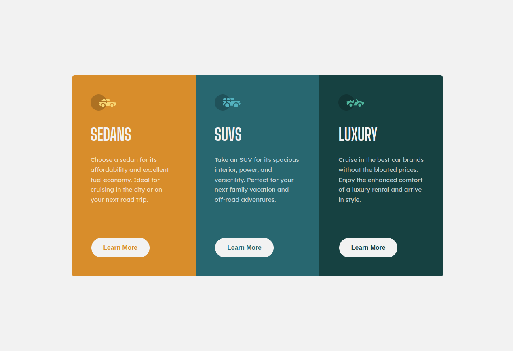

# Frontend Mentor - 3-column preview card component solution

This is a solution to the [3-column preview card component challenge on Frontend Mentor](https://www.frontendmentor.io/challenges/3column-preview-card-component-pH92eAR2-). Frontend Mentor challenges help you improve your coding skills by building realistic projects.

## Table of contents

- [Overview](#overview)
  - [The challenge](#the-challenge)
  - [Screenshot](#screenshot)
  - [Links](#links)
- [My process](#my-process)
  - [Built with](#built-with)
- [Author](#author)

## Overview

### The challenge

Users should be able to:

- View the optimal layout depending on their device's screen size
- See hover states for interactive elements

### Screenshots

### Links

- Solution URL: [Solution URL here](https://www.frontendmentor.io/solutions/3-column-preview-card-component-in-html-css-and-javascript-AuzAAfp1jP)
- Live Site URL: [Live site URL here](https://harpreet-singh-147.github.io/frontend-mentor-column-preview-card/)

## My process

### Built with

- Semantic HTML5 markup
- CSS custom properties
- Flexbox
- JavaScript

## Author

- Frontend Mentor - [@harpreet-singh-147](https://www.frontendmentor.io/profile/harpreet-singh-147)
- Twitter - [@D147Harpreet](https://twitter.com/D147Harpreet)
